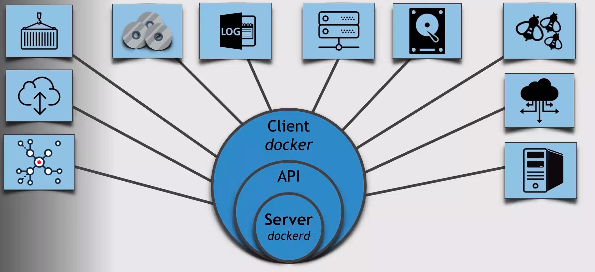

### Introduction to docker.
##### Annotations
Should only handle one process in the system.

Use container linking.

Can be stop/destroy.

Use volume.

Configuration should be injected in the environment.

##### Container Exercise I

    docker run -d -p 8080:8080 --name my-container -v /home/user/my-volume:/var/www/html my-image

##### Components docker

 Docker Engine

    Consists of:
    * Docker server
        dockerd
    * Docker client
        docker
    * API
        docker run

    Hub: cloud registry service
    Compose: multiple services
    Image: image
    Network: network
    Logs: logs
    Swarm: cluster
    Data Volume: volume can share data between containers
    Container: container
    Docker Registry: registry
    Docker Machine: virtual machine

##### Docker Images

  Images vs Containers
    docker containers are built from images.
  Docker Images:
    Consists of layers of files.
    
